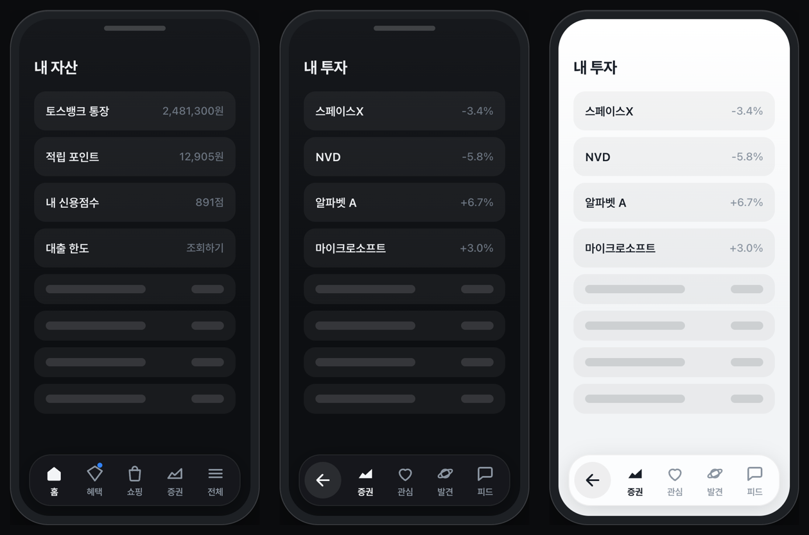
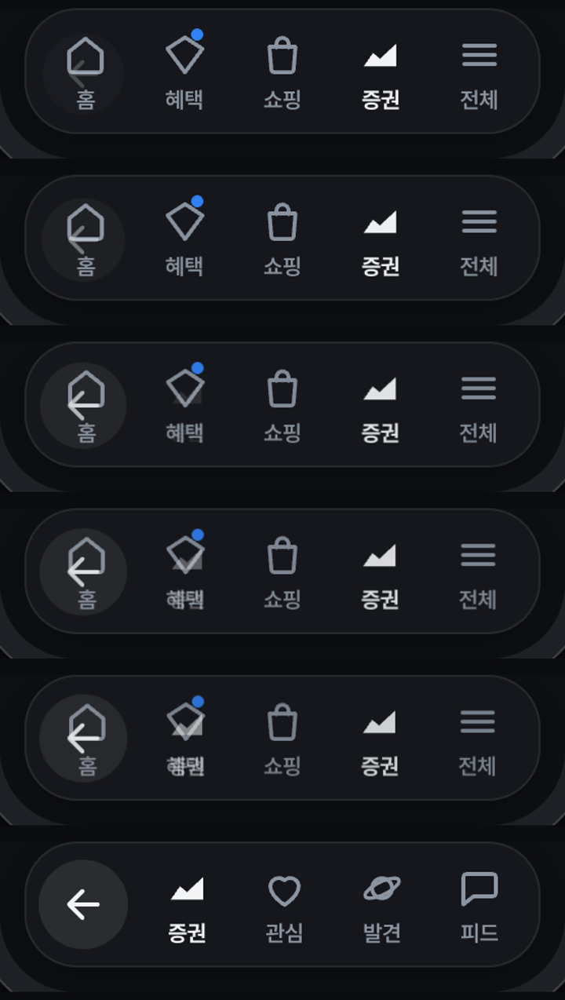

# react-contextual-tab-bar

A bottom tab bar whose items **swap into a contextual sub-set** when you enter a section, with a back
affordance taking the first slot. Zero runtime dependencies, ~4.5 kB gzipped (JS + CSS).



**[Live demo →](https://axelerate-kr.github.io/react-contextual-tab-bar/)**

## Why this exists

Every animated tab-bar library animates the *indicator* inside a fixed set of tabs —
[`react-native-animated-nav-tab-bar`](https://github.com/torgeadelin/react-native-animated-nav-tab-bar),
[`rn-wave-bottom-bar`](https://github.com/darkhorse-coder/rn-wave-bottom-bar),
[`morph-bottom-navigation`](https://github.com/tommybuonomo/morph-bottom-navigation),
React Navigation's `animation: 'fade' | 'shift'`, Material's `BottomNavigation`.

None of them change *which tabs exist*. The pattern where entering a section replaces the whole row
with that section's own tabs — and puts a back arrow where the first tab used to be — isn't in
Material 3, isn't in the iOS HIG, and isn't in any tab-bar package I could find. It comes from the
[Toss](https://toss.im) app, whose design system isn't open source.

This is an independent implementation of that pattern for the web.

## Install

```sh
npm i react-contextual-tab-bar
```

```tsx
import { ContextualTabBar } from 'react-contextual-tab-bar'
import 'react-contextual-tab-bar/styles.css'
```

## Usage

Giving a tab an `items` array is the whole opt-in: tapping it pushes a level instead of selecting it.

```tsx
const items = [
  { id: 'home',    label: 'Home',     icon: <Home />, activeIcon: <Home filled /> },
  { id: 'benefit', label: 'Benefits', icon: <Gift />, badge: true },
  {
    id: 'stocks',
    label: 'Stocks',
    icon: <Chart />,
    activeIcon: <Chart filled />,
    items: [
      { id: 'stocks.home',     label: 'Stocks',    icon: <Chart /> },
      { id: 'stocks.watch',    label: 'Watchlist', icon: <Heart /> },
      { id: 'stocks.discover', label: 'Discover',  icon: <Planet /> },
      { id: 'stocks.feed',     label: 'Feed',      icon: <Chat /> },
    ],
  },
  { id: 'more', label: 'More', icon: <Menu /> },
]

function App() {
  const [value, setValue] = useState('home')

  return (
    <ContextualTabBar
      items={items}
      value={value}
      onChange={(id) => setValue(id)}
      onEnterSub={(id) => analytics.track('tab_section_enter', { id })}
      onBack={(id) => analytics.track('tab_section_exit', { id })}
    />
  )
}
```

`value` / `onChange` and `path` / `onPathChange` are both optional — omit them and the component
keeps the state itself (`defaultValue`, `defaultPath`). Control `path` when the level should be
derived from your router.

`onChange` fires for every active-tab change and tells you why:

| `meta.reason` | when |
| --- | --- |
| `'select'` | an ordinary tab was tapped |
| `'enter'` | a tab with `items` was tapped; the first child became active |
| `'back'` | the level was left; the parent tab became active again |

## The transition



The two rows are laid out **independently and cross-faded**, rather than moved as shared elements.
The outgoing row keeps its own positions while it fades and scales to `0.94`; the incoming row fades
in at its new positions, each item delayed by `stagger` from the leading edge — so for a moment two
different rows are visible at two different layouts. That overlap is the effect.

| prop | default | what it controls |
| --- | --- | --- |
| `duration` | `190` | enter animation per item (ms) |
| `stagger` | `24` | delay added per item, leading edge first (ms) |
| `exitDuration` | `140` | outgoing row fade (ms) |

Total ≈ `stagger × (items − 1) + duration`. Direction matters: going deeper staggers left → right,
going back staggers right → left, so the motion follows the gesture.

`prefers-reduced-motion: reduce` collapses the whole thing to a plain fade with no stagger.

## Props

| prop | type | default | |
| --- | --- | --- | --- |
| `items` | `TabItem[]` | — | root level tabs |
| `value` | `string` | — | active tab id (controlled) |
| `defaultValue` | `string` | first root tab | active tab id (uncontrolled) |
| `onChange` | `(id, meta) => void` | — | fires on every active-tab change |
| `path` | `string[]` | — | entered ancestor ids (controlled); `[]` is the root |
| `defaultPath` | `string[]` | `[]` | entered ancestor ids (uncontrolled) |
| `onPathChange` | `(path) => void` | — | level changed |
| `onEnterSub` | `(id, item) => void` | — | a tab with `items` was tapped |
| `onBack` | `(id, path) => void` | — | a level was left |
| `variant` | `'floating' \| 'docked'` | `'floating'` | side margins and radius, or full width |
| `theme` | `'dark' \| 'light' \| 'auto'` | `'auto'` | `auto` follows `prefers-color-scheme` |
| `fixed` | `boolean` | `true` | `position: fixed` at the bottom of the viewport |
| `backIcon` | `ReactNode` | arrow-left | |
| `backLabel` | `string` | `'Back'` | `aria-label` for the back affordance |
| `duration` `stagger` `exitDuration` | `number` | `190` `24` `140` | see above |
| `className` `style` | | | applied to the outer wrapper |
| `ariaLabel` | `string` | `'Main'` | `aria-label` for the tablist |

### `TabItem`

| field | type | |
| --- | --- | --- |
| `id` | `string` | unique within its own level |
| `label` | `string?` | omit for an icon-only tab |
| `icon` | `ReactNode?` | inactive icon (outline variant) |
| `activeIcon` | `ReactNode?` | active icon; cross-fades with `icon` over 170 ms |
| `items` | `TabItem[]?` | **the opt-in** — makes this tab push a level |
| `badge` | `number \| string \| true` | `true` renders a bare dot |
| `disabled` | `boolean?` | |
| `ariaLabel` | `string?` | defaults to `label ?? id` |

Nesting is not limited to one level — a sub-tab can have `items` of its own, and `path` grows
accordingly.

## Theming

Every visual is a CSS custom property on `.ctb-root`. Override them anywhere in your cascade:

```css
.ctb-root {
  --ctb-surface: rgba(24, 26, 29, 0.78);   /* bar background (blurred) */
  --ctb-surface-opaque: #191b1e;           /* fallback without backdrop-filter */
  --ctb-border: rgba(255, 255, 255, 0.07);
  --ctb-shadow: 0 6px 24px rgba(0, 0, 0, 0.32);
  --ctb-fg: #f2f4f6;                       /* active icon + label */
  --ctb-fg-muted: #8b95a1;                 /* inactive */
  --ctb-chip: rgba(255, 255, 255, 0.09);   /* back affordance background */
  --ctb-press: rgba(255, 255, 255, 0.13);  /* press highlight */
  --ctb-accent: #3182f6;                   /* badge + focus ring */
  --ctb-radius: 26px;
  --ctb-height: 60px;
  --ctb-inset: 12px;                       /* floating side margin */
  --ctb-icon-size: 24px;
  --ctb-ease-enter: cubic-bezier(0.22, 1, 0.36, 1);
  --ctb-ease-exit: cubic-bezier(0.4, 0, 1, 1);
}
```

The bar uses `backdrop-filter` with an opaque `@supports` fallback, and adds
`env(safe-area-inset-bottom)` so it clears the iOS home indicator.

## Accessibility

- The visible row is a `role="tablist"` of `role="tab"` buttons with `aria-selected`; the outgoing
  row is `aria-hidden` and untabbable while it fades.
- Roving tabindex: <kbd>←</kbd> <kbd>→</kbd> <kbd>Home</kbd> <kbd>End</kbd> move focus,
  <kbd>Enter</kbd> / <kbd>Space</kbd> activate, <kbd>Esc</kbd> leaves a level.
- The back affordance is a plain button, not a tab, and carries `aria-label`.
- Entering a level announces the section name through a polite live region.
- `prefers-reduced-motion` is honoured.

## Development

```sh
npm install
npm run dev        # demo at localhost:5173
npm run typecheck
npm run build      # demo → dist-demo
npm run build:lib  # package → dist
```

## License

MIT. The interaction pattern was observed in the Toss app; this implementation is independent and
unaffiliated.
