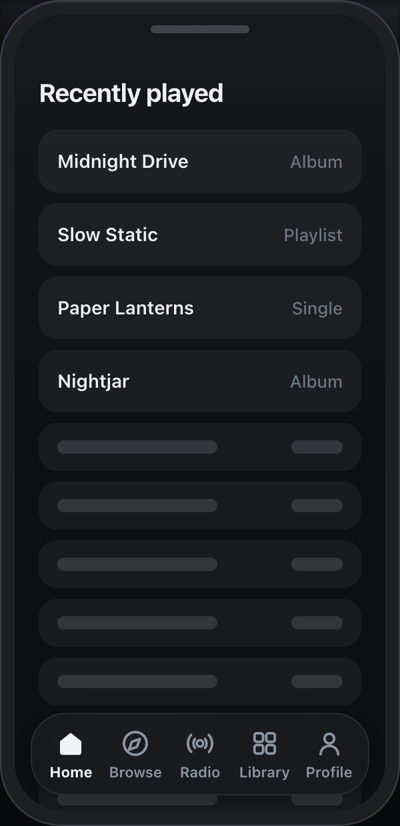

# react-contextual-tab-bar

**리액트용 토스 스타일 하단 네비게이션 바.** 탭을 누르면 네비게이션 바 자체가 그 섹션의 탭 구성으로
교체되고, 첫 번째 탭이 있던 자리에 뒤로가기 화살표가 들어옵니다. 런타임 의존성 없음, gzip 약 4.5 kB
(JS + CSS).

[English README →](README.md)



실제 속도로 녹화했습니다 — 전환은 처음부터 끝까지 약 240ms입니다.

**[라이브 데모 →](https://axelerate-kr.github.io/react-contextual-tab-bar/)**

## 왜 만들었나

애니메이션이 있는 탭바 라이브러리는 전부 **고정된 탭 세트 안에서 인디케이터만** 움직입니다 —
[`react-native-animated-nav-tab-bar`](https://github.com/torgeadelin/react-native-animated-nav-tab-bar),
[`rn-wave-bottom-bar`](https://github.com/darkhorse-coder/rn-wave-bottom-bar),
[`morph-bottom-navigation`](https://github.com/tommybuonomo/morph-bottom-navigation),
React Navigation의 `animation: 'fade' | 'shift'`, Material의 `BottomNavigation`.

**어느 것도 "탭 구성 자체"를 바꾸지 않습니다.** 섹션에 들어가면 행 전체가 그 섹션의 탭으로 교체되고
첫 탭 자리에 뒤로가기가 들어오는 이 패턴은 Material 3에도, iOS HIG에도, 제가 찾아본 어떤 탭바
패키지에도 없습니다. [토스](https://toss.im) 앱이 널리 퍼뜨린 패턴이고, 토스의 디자인 시스템은
오픈소스가 아닙니다.

이 저장소는 그 패턴을 웹에서 독립적으로 구현한 것입니다.

## 설치

```sh
npm i react-contextual-tab-bar
```

```tsx
import { ContextualTabBar } from 'react-contextual-tab-bar'
import 'react-contextual-tab-bar/styles.css'
```

## 사용법

탭에 `items` 배열을 주는 것이 전부입니다. `items`가 있는 탭은 눌렀을 때 선택되는 대신 하위 레벨로
들어갑니다.

```tsx
const items = [
  { id: 'home',  label: '홈',    icon: <Home />, activeIcon: <Home filled /> },
  { id: 'radio', label: '라디오', icon: <Broadcast /> },
  {
    id: 'library',
    label: '보관함',
    icon: <Grid />,
    activeIcon: <Grid filled />,
    items: [
      { id: 'library.home',    label: '보관함',  icon: <Grid /> },
      { id: 'library.songs',   label: '곡',      icon: <Playlist /> },
      { id: 'library.artists', label: '아티스트', icon: <Mic /> },
      { id: 'library.offline', label: '오프라인', icon: <Download />, badge: 3 },
    ],
  },
  { id: 'profile', label: '프로필', icon: <Person /> },
]

function App() {
  const [value, setValue] = useState('home')

  return (
    <ContextualTabBar
      items={items}
      value={value}
      onChange={(id) => setValue(id)}
      onEnterSub={(id) => analytics.track('tab_section_enter', { id })}
      onBack={(id) => analytics.track('tab_section_exit', { id })}
    />
  )
}
```

`value` / `onChange` 와 `path` / `onPathChange` 는 둘 다 선택입니다. 넘기지 않으면 컴포넌트가 상태를
직접 들고 있습니다 (`defaultValue`, `defaultPath`). 레벨을 라우터에서 파생시키고 싶을 때 `path`를
제어하세요.

`onChange`는 활성 탭이 바뀔 때마다 호출되고, 왜 바뀌었는지 알려줍니다:

| `meta.reason` | 언제 |
| --- | --- |
| `'select'` | 일반 탭을 눌렀을 때 |
| `'enter'` | `items`가 있는 탭을 눌러 하위 레벨에 들어갔을 때. 첫 자식이 활성화됩니다 |
| `'back'` | 레벨을 벗어났을 때. 부모 탭이 다시 활성화됩니다 |

## 전환 애니메이션


두 행은 **각자의 레이아웃을 유지한 채 크로스페이드**합니다. 공유 요소를 이동시키는 방식이 아닙니다.
나가는 행은 원래 위치를 그대로 지킨 채 투명해지며 `0.94`로 축소되고, 들어오는 행은 새 위치에서
페이드인하는데 각 항목이 진행 방향 앞쪽부터 `stagger`만큼 지연됩니다. 그래서 한순간 **서로 다른 두
행이 서로 다른 레이아웃으로 동시에 보입니다.** 그 겹침이 이 효과의 핵심입니다.

| prop | 기본값 | 역할 |
| --- | --- | --- |
| `duration` | `190` | 항목 하나의 진입 애니메이션 (ms) |
| `stagger` | `24` | 항목마다 더해지는 지연, 진행 방향 앞쪽부터 (ms) |
| `exitDuration` | `140` | 나가는 행의 페이드아웃 (ms) |

전체 시간 ≈ `stagger × (항목 수 − 1) + duration`. 방향도 반영됩니다 — 더 깊이 들어갈 때는 왼쪽에서
오른쪽으로, 뒤로 나올 때는 오른쪽에서 왼쪽으로 지연되어 모션이 조작 방향을 따라갑니다.

`prefers-reduced-motion: reduce`에서는 stagger 없는 단순 페이드로 줄어듭니다.

## Props

| prop | 타입 | 기본값 | |
| --- | --- | --- | --- |
| `items` | `TabItem[]` | — | 루트 레벨 탭 |
| `value` | `string` | — | 활성 탭 id (제어) |
| `defaultValue` | `string` | 첫 루트 탭 | 활성 탭 id (비제어) |
| `onChange` | `(id, meta) => void` | — | 활성 탭이 바뀔 때마다 |
| `path` | `string[]` | — | 들어간 상위 탭 id들 (제어). `[]`가 루트 |
| `defaultPath` | `string[]` | `[]` | 들어간 상위 탭 id들 (비제어) |
| `onPathChange` | `(path) => void` | — | 레벨이 바뀔 때 |
| `onEnterSub` | `(id, item) => void` | — | `items`가 있는 탭을 눌렀을 때 |
| `onBack` | `(id, path) => void` | — | 레벨을 벗어났을 때 |
| `variant` | `'floating' \| 'docked'` | `'floating'` | 좌우 여백 + 라운드, 또는 화면 전체 폭 |
| `theme` | `'dark' \| 'light' \| 'auto'` | `'auto'` | `auto`는 `prefers-color-scheme`을 따름 |
| `fixed` | `boolean` | `true` | 뷰포트 하단에 `position: fixed` |
| `backIcon` | `ReactNode` | 왼쪽 화살표 | |
| `backLabel` | `string` | `'Back'` | 뒤로가기 버튼의 `aria-label` |
| `duration` `stagger` `exitDuration` | `number` | `190` `24` `140` | 위 참조 |
| `className` `style` | | | 최상위 래퍼에 적용 |
| `ariaLabel` | `string` | `'Main'` | tablist의 `aria-label` |

### `TabItem`

| 필드 | 타입 | |
| --- | --- | --- |
| `id` | `string` | 같은 레벨 안에서 유일해야 함 |
| `label` | `string?` | 생략하면 아이콘만 있는 탭 |
| `icon` | `ReactNode?` | 비활성 아이콘 (보통 outline) |
| `activeIcon` | `ReactNode?` | 활성 아이콘. `icon`과 170ms 동안 크로스페이드 |
| `items` | `TabItem[]?` | **이게 스위치** — 이 탭이 레벨을 push하게 만듦 |
| `badge` | `number \| string \| true` | `true`면 점만 표시 |
| `disabled` | `boolean?` | |
| `ariaLabel` | `string?` | 기본값은 `label ?? id` |

한 단계로 제한되지 않습니다 — 하위 탭도 자기 `items`를 가질 수 있고, `path`가 그만큼 깊어집니다.

라벨은 짧게 쓰세요. 탭 한 칸은 좁아서 영어로 8자를 넘으면 말줄임표가 생깁니다 (한글은 4자 정도까지
안전합니다).

## 테마


모든 시각 요소가 `.ctb-root`의 CSS 커스텀 프로퍼티입니다. 캐스케이드 어디에서든 덮어쓸 수 있습니다:

```css
.ctb-root {
  --ctb-surface: rgba(24, 26, 29, 0.78);   /* 바 배경 (블러) */
  --ctb-surface-opaque: #191b1e;           /* backdrop-filter 미지원 시 대체 */
  --ctb-border: rgba(255, 255, 255, 0.07);
  --ctb-shadow: 0 6px 24px rgba(0, 0, 0, 0.32);
  --ctb-fg: #f2f4f6;                       /* 활성 아이콘 + 라벨 */
  --ctb-fg-muted: #8b95a1;                 /* 비활성 */
  --ctb-chip: rgba(255, 255, 255, 0.09);   /* 뒤로가기 버튼 배경 */
  --ctb-press: rgba(255, 255, 255, 0.13);  /* 누를 때 하이라이트 */
  --ctb-accent: #3182f6;                   /* 배지 + 포커스 링 */
  --ctb-radius: 26px;
  --ctb-height: 60px;
  --ctb-inset: 12px;                       /* floating일 때 좌우 여백 */
  --ctb-icon-size: 24px;
  --ctb-ease-enter: cubic-bezier(0.22, 1, 0.36, 1);
  --ctb-ease-exit: cubic-bezier(0.4, 0, 1, 1);
}
```

바는 `backdrop-filter`를 쓰고 미지원 환경을 위한 `@supports` 대체가 있습니다. iOS 홈 인디케이터를
피하도록 `env(safe-area-inset-bottom)`도 더합니다.

## 접근성

- 보이는 행은 `aria-selected`가 붙은 `role="tab"` 버튼들의 `role="tablist"`입니다. 사라지는 행은
  페이드되는 동안 `aria-hidden`이고 탭 포커스를 받지 않습니다.
- roving tabindex: <kbd>←</kbd> <kbd>→</kbd> <kbd>Home</kbd> <kbd>End</kbd> 로 포커스 이동,
  <kbd>Enter</kbd> / <kbd>Space</kbd> 로 선택, <kbd>Esc</kbd> 로 레벨 나가기.
- 뒤로가기는 탭이 아니라 일반 버튼이고 `aria-label`을 가집니다.
- 레벨에 들어가면 polite live region으로 섹션 이름을 읽어줍니다.
- `prefers-reduced-motion`을 존중합니다.

## 이런 걸 찾으셨다면

아래 중 하나로 검색해서 오셨다면, 찾던 컴포넌트가 맞습니다.

**한국어** — 토스 스타일 하단 네비게이션 바 · 토스 네비게이션바 · 토스 하단바 · 토스처럼 탭 누르면
바뀌는 네비게이션 바 · 하단 네비게이션 전환 애니메이션 · 바텀 네비게이션 · 서브 탭바 ·
리액트 하단바 · 뒤로가기 버튼 있는 하단 네비게이션

**English** — Toss-style bottom navigation bar · Toss tab bar · contextual bottom navigation ·
nested bottom tabs · sub-tabs inside a tab bar · morphing tab bar · animated bottom navigation ·
bottom bar that swaps its tabs · drill-down tab bar

## 개발

```sh
npm install
npm run dev        # 데모: localhost:5173
npm run typecheck
npm run build      # 데모 → dist-demo
npm run build:lib  # 패키지 → dist
```

## 라이선스

Apache License 2.0 — [LICENSE](LICENSE) 와 [NOTICE](NOTICE) 참조.

이 인터랙션 패턴은 토스 앱이 널리 퍼뜨린 것입니다. 이 구현은 관찰한 동작을 바탕으로 독립적으로
작성했고 해당 앱의 코드나 디자인 애셋을 포함하지 않으며, 토스 및 그 운영사와 제휴 관계가 없고
승인받은 것도 아닙니다. 문서와 패키지 메타데이터에 "토스"가 등장하는 것은 이 패턴을 찾는 사람이
이 컴포넌트를 발견할 수 있도록 패턴을 설명하기 위한 목적입니다.
